目标跟踪

目标跟踪研究综述


#### YOLOV5

1. 环境配置

   ```
   # 进入pytorch终端，输入命令
   pip install -r requirements.txt
   # 针对pycocotools问题，输入命令
   pip install pycocotools
   ```

   错误1

   

   - 输入命令：pip install -r requirements.txt

   错误2

   

   - 需要下载C++编译工具：https://visualstudio.microsoft.com/visual-cpp-build-tools/

   ​	

   

   - 输入命令：pip install pycocotools

2. 运行"detect.py"报错

   

   解决方法：在"model/common.py"中加入下面的代码

   ```
   import warnings
    
    
    
   class SPPF(nn.Module):
       # Spatial Pyramid Pooling - Fast (SPPF) layer for YOLOv5 by Glenn Jocher
       def __init__(self, c1, c2, k=5):  # equivalent to SPP(k=(5, 9, 13))
           super().__init__()
           c_ = c1 // 2  # hidden channels
           self.cv1 = Conv(c1, c_, 1, 1)
           self.cv2 = Conv(c_ * 4, c2, 1, 1)
           self.m = nn.MaxPool2d(kernel_size=k, stride=1, padding=k // 2)
    
       def forward(self, x):
           x = self.cv1(x)
           with warnings.catch_warnings():
               warnings.simplefilter('ignore')  # suppress torch 1.9.0 max_pool2d() warning
               y1 = self.m(x)
               y2 = self.m(y1)
               return self.cv2(torch.cat([x, y1, y2, self.m(y2)], 1))
   ```

   

3. "detect.py"文件参数介绍

   

   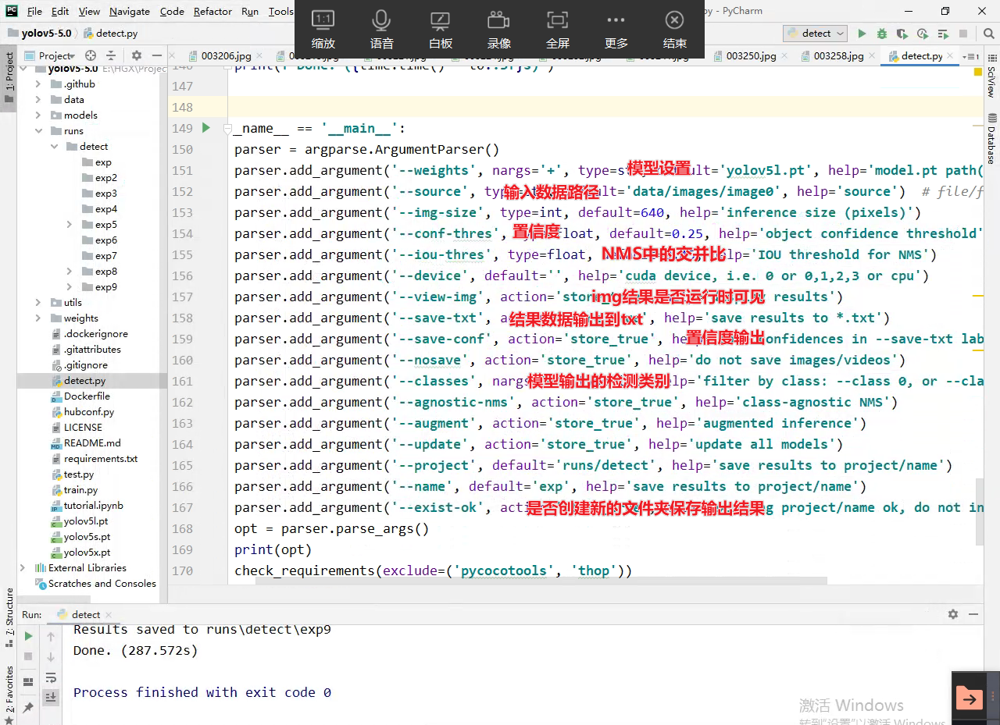

   模型训练使用的图片尺寸

   

   训练"img-size"与输入输出img尺寸

   

4. 模型训练"train.py"

   执行"train.py"，模型输出如下

   

   模型训练使用的数据集

   

   模型参数配置数据

   

   模型超参数

   

   main函数参数介绍

   

5. 自制数据集训练

   - 数据集获取方式

     人工标注；仿真数据集（GAN）

   - 在线标注工具：https://www.makesense.ai/

     

   - 创建训练文件的目录结构

     

   - 添加数据集的配置文件

     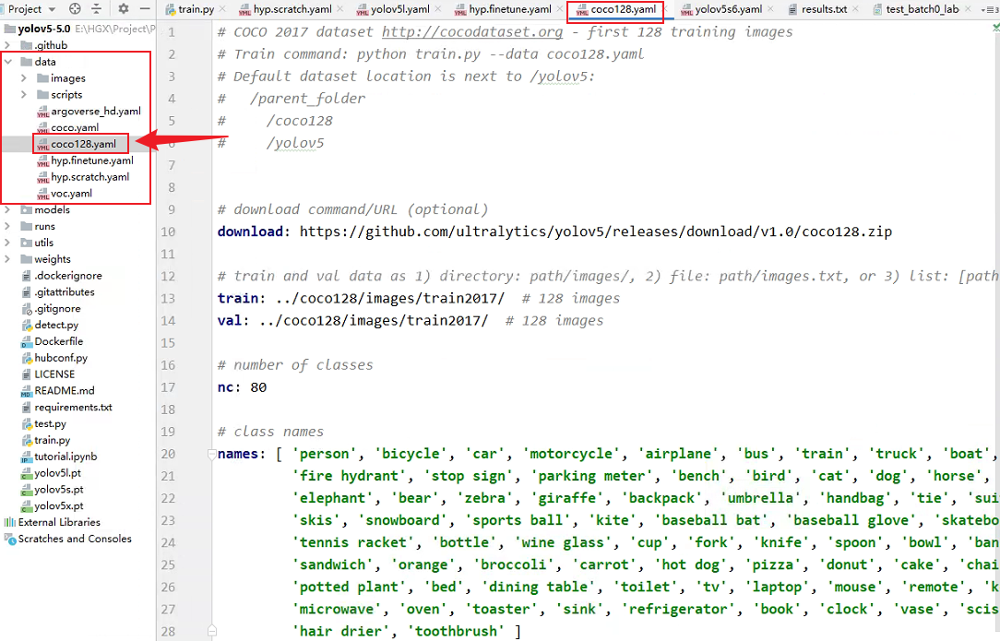

#### 在anaconda创建pytorch环境

1. 打开anaconda prompt，输入命令

   ```shell
   # 环境名称：pytorchhgx 依赖的python版本：3.6 可以在"Anaconda3\envs\"目录下查看环境文件
   conda create -n pytorchhgx python=3.6
   # 激活环境
   conda activate pytorchhgx
   # 取消激活
   conda deactivate
   # 查看当前环境有哪些包
   pip list/conda list
   # 查看驱动版本。可以查看“驱动”、“cuda"版本信息
   nvidia-smi
   # 检查pytoch是否安装成功
   python
   import torch
   exit() #退出python状态
   # 检查pytorch是否可以使用GPU
   torch.cuda.is_available()
   # 查看已有的环境
   conda info --envs
   # 删除创建的虚拟环境
   conda remove -n 环境名 --all
   # 安装jupyter
   conda install nb_conda
   # 启动jupyter
   jupyter notebook
   # 运行jupyter代码块
   "Shift + Enter"
   ```

   问题：启动jupyter没有弹出页面

   ​	cmd
   ​	jupyter notebook --generate-config # 生成配置文件

   ​	修改配置文件

   ​	

   设置jupyter启动路径（从命令行打开jupyter）

   ​	

   

2. 查看电脑的显卡是否支持cuda

   方法1：进入网址https://www.geforce.cn/hardware/technology/cuda/supported-gpus

   方法2：打开NVIDIA控制面板->系统信息->组件

   依据显卡是否支持cuda，在pytorch官网选择对应的pytorch安装命令。

3. 安装python编辑器

   pycharm

   jupyter（交互式）

   ```
   # 在pytorch环境中安装jupyter
   进入pytorch环境，安装依赖
   conda install nb_conda
   ```


#### Git分布式版本控制

##### 1.工作机制及托管中心介绍


代码托管中心是基于网络服务器的远程代码仓库，简称远程库。（push）


##### 2.Git常用命令


```shell
# 设置用户签名
只需设置一次，但必须设置，否则无法提交代码。执行完下列命令，可以在用户加目录"C:\Users\86153"查看到".gitconfig"的文件。签名的作用是区分不同操作者身份，用户的签名信息在每一个版本的提交信息中能够看到；这里设置用户签名和登录Github（或其他代码托管中心）的账号没有任何关系。
git config --global user.name mango
git config --global user.email virtual@.com
# 初始化本地库
git init
# 查看本地库状态
git status
# 文件添加到暂存区
git add 文件名
# 将文件从暂存区删除(本地目录的工作区中的文件还在)
git rm --cached hello.txt
# 将所有文件从暂存区删除
git rm --cached -r *
# 将暂存区的文件提交到本地库
git commit -m "日志信息" 文件名
# 将所有暂存区文件提交到本地库
git commit -m "日志信息"
# 查看精简历史信息(精简版本号、分支、日志)
git reflog
# 查看详细历史信息（详细版本号、提交者信息、提交日期）
git log
# 版本穿梭（通过HEAD指向的版本号，实现向前穿梭、向后穿梭）
git reset --hard 版本号
# 克隆版本回滚
git checkout b6f4ceae
```

其他命令

```
# 把本地所有untrack的文件都加入暂存区，并且会根据.gitignore做过滤
git add .
# 把本地所有untrack的文件都加入暂存区，会忽略.gitignore
git add *
```

查看本地库状态


在工作区新建一个hello.txt文件后（红色表示文件未被追踪！）

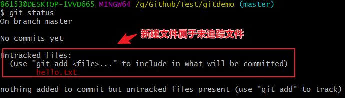

将hello.txt提交到暂存区。将文件从**暂存区**（工作区中文件还在）中删除"git rm --cached hello.txt"


将文件从暂存区提交到本地库


查看提交信息


查看提交者信息


**修改已提交到本地库的文件**（修改后红色表示此时文件未被追踪）


将修改后的文件**再次**提交到暂存区


从暂存区中，将修改后的文件再次提交到本地库（指针指向第二个版本！）


从第二个版本回到第一个版本（也可以从第一个版本再次返回第二个版本！）


版本穿梭示意图


##### 3.Git_分支


```
# 查看分支
git branch -v
# 创建分支
git branch 分支名
# 切换分支(工作区文件对应当前指向的分支)
git checkout 分支名
# 合并分支(把指定的分支合并到当前分支上)
git merge 分支名
```

查看分支


创建分支


切换分支


合并分支


冲突合并（手动编辑冲突文件进行修改）


合并分支只会修改合并的分支。修改完冲突代码后，需要重新提交文件；而且commit不能带文件名


##### 4.Git_团队协作

团队内协作


跨团队协作


##### 5.Git_Github


```
# 查看当前远程库别名
git remote -v
# 给远程库起别名
git remote add 别名 远程地址 # 远程地址是http链接
# git命令行中的复制快捷键
Shift+Insert
# 推送本地库分支内容到远程仓库（需要验证账号）
git push 别名 分支
# 将远程仓库对于分支最新内容拉下来后与当前本地分支直接合并。拉取动作会自动提交到本地库
git pull 远程库地址别名 远程分支名
# 针对上传和拉取问题，有时需要关闭ssl验证
git config --global http.sslVerify "false"
# 将远程仓库的内容克隆到本地(不需要验证账号)：1拉取代码；2初始化本地库；3远程库取别名为"origin"
git clone 远程地址
# 进入到用户家目录"C:\Users\86153"打开Git，输入以下命令生成ssh密钥
ssh-keygen -t rsa -C 2965531503@qq.com #邮箱是Github账号的邮箱
# 测试ssh是否配置成功
ssh -T git@github.com  # ssh -T -p 443 git@ssh.github.com
```

给远程库创建别名


**推动本地库分支内容到远程库**

- 打开“凭据管理器”，查看是否有证书凭据

  

- 授予许可：授权后就会增加github的普通凭据

  

- 推送成功

  

**拉取远程库到本地库**

- Github网页对文件进行编辑修改并"commit"后，如何拉取到本地库

- 接触SSL验证后，拉取成功（拉取动作会自动提交到本地库）

  

**将远程库克隆到本地**


​	克隆会自动给远程库取别名为"origin"


Git团队内协作：A账号push的代码。B账号克隆下来进行编辑修改后，再push到A的github项目中。

- 需要在A的github项目中，添加B为团队成员

  

  ​	A账号添加邀请B，生成邀请链接发送给B账号

  

  ​	B账号接收A的团队邀请，就可以push代码到远程库！

  

Git跨团队协作：fork()


SSH免密登录：设置ssh后，可以免密拉取

```
# 进入到用户家目录"C:\Users\86153"打开Git，输入命令
ssh-keygen -t rsa -C 2965531503@qq.com #邮箱是Github账号的邮箱
```

​	生成".ssh"文件夹，包含公钥和私钥


​	将公钥内容添加到Github账号中


##### 问题汇总

问题1描述：


解决方法：

​	进入.git目录下的config文件


​	将url地址改为ssh地址

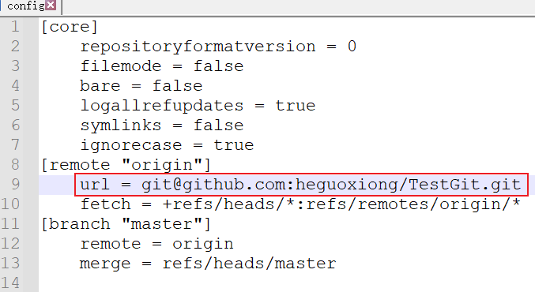

问题2描述：


解决方法：

进入凭据管理器，删掉

#### vim命令

```
# 复制（退出插入模式）
yy
# 粘贴（退出插入模式）
p
```

#### Linux命令

基本命令

```shell
# 查看文件中的内容
cat hello.txt
# 查看文件中最后一行的内容
tail -n 1 hello.txt
# 查看目录下各文件信息
ll
# 切换到root用户
sudo -s
# 退出root用户
exit
```

查看安装库的命令

```shell
# 查看安装的opencv版本
pkg-config --modversion opencv
=="3.4.16"
# 方法一：查看opencv安装库的位置
pkg-config --libs opencv
=="/usr/local/lib/"
# opencv安装后头文件的位置
=="/usr/local/include/"

# 方法二：查看opencv安装路径
# 搜索带有关键字opencv的所有文件及文件夹都会输出到终端
sudo find / -iname "*opencv*"
# 搜索带有关键字opencv的所有文件及文件夹输出到txt文件
sudo find / -iname "*opencv*" > /home/mango/Desktop/opencv_find.txt

# pcl1.12安装库路径
/usr/lib/
# pcl头文件路径
/usr/include

# 卸载一个库的步骤
# 1.删除头文件
sudo rm -r /usr/local/include/sophus
# 2.删除库文件
sudo rm -r /usr/local/lib/libsophus*
# 3.删除库的可执行文件
sudo rm -r /usr/local/bin/sophus*
```

ldconfig：动态链接库管理命令

**ldconfig命令** 的用途主要是在默认搜寻目录`/lib`和`/usr/lib`以及动态库配置文件`/etc/ld.so.conf`内所列的目录下，搜索出可共享的动态链接库（格式如lib*.so*）,进而创建出动态装入程序(ld.so)所需的连接和缓存文件。缓存文件默认为`/etc/ld.so.cache`，此文件保存已排好序的动态链接库名字列表，为了让动态链接库为系统所共享，需运行动态链接库的管理命令ldconfig，此执行程序存放在`/sbin`目录下。

ldconfig通常在系统启动时运行，而当用户安装了一个新的动态链接库时，就需要手工运行这个命令。

```
# 语法
ldconfig [-v|--verbose] [-n] [-N] [-X] [-f CONF] [-C CACHE] [-r ROOT] [-l] [-p|--print-cache] [-c FORMAT] [--format=FORMAT] [-V] -?|--[help|--usage] path...
```

**ldconfig几个需要注意的地方：**

1. 往`/lib`和`/usr/lib`里面加东西，是不用修改`/etc/ld.so.conf`的，但是完了之后要调一下ldconfig，不然这个library会找不到。
2. 想往上面两个目录以外加东西的时候，一定要修改`/etc/ld.so.conf`，然后再调用ldconfig，不然也会找不到。
3. **比如安装了一个mysql到`/usr/local/mysql`，mysql有一大堆library在`/usr/local/mysql/lib`下面，这时就需要在`/etc/ld.so.conf`下面加一行`/usr/local/mysql/lib`，保存过后ldconfig一下，新的library才能在程序运行时被找到**。
4. 如果想在这两个目录以外放lib，但是又不想在`/etc/ld.so.conf`中加东西（或者是没有权限加东西）。那也可以，就是export一个全局变量LD_LIBRARY_PATH，然后运行程序的时候就会去这个目录中找library。一般来讲这只是一种临时的解决方案，在没有权限或临时需要的时候使用。
5. ldconfig做的这些东西都与运行程序时有关，跟编译时一点关系都没有。编译的时候还是该加-L就得加，不要混淆了。
6. 总之，就是不管做了什么关于library的变动后，最好都ldconfig一下，不然会出现一些意想不到的结果。不会花太多的时间，但是会省很多的事。
7. 再有，诸如libdb-4.3.so文件头中是会含有库名相关的信息的（即含“libdb-4.3.so”，可用strings命令察看），因此 仅通过修改文件名以冒充某已被识别的库（如libdb-4.8.so）是行不通的。为此可在编译库的Makefile中直接修改配置信息，指定特别的库名。

#### Windows命令

```shell
# 如果你要删除的整个文件夹以及文件夹里面的所有内容的话
rd/s/q #盘符:某个文件夹 （这样整个文件夹所有的文件和文件夹都删除了）
# 比如我想删除D盘的123文件夹以及123文件夹里面所有的内容
rd/s/q d:123 # 这样就删除了

# 如果只是单独删除某个文件的话用
del/f/s/q 盘符:文件名
# 比如我想删除D盘的456文件夹里面的789这个记事本文件
del/f/s/q d:456789.txt
# 删除文件的话记住要加上它的后缀名

# 删除当前目录下的所有文件
del *
y

```


#### VSCode

1. Windows搭建vscode

   - 开发环境搭建

     - 安装mingw-w64编译器（GCC for Windows）、CMake工具（选装）

       The mingw-w64 project is a complete runtime environment for **gcc** to support binaries native to Windows 64-bit and 32-bit operating systems.

       

       gcc：C语言编译器

       g++：C++语言编译器

     - vscode插件安装

       - C/C++
       - cmake（选装）
       - cmake tools（选装）

   - 代码实践演练

     - 基于g++的命令

       ```shell
       # 使用g++编译cpp文件，生成a.exe可执行文件
       g++ main.cpp
       # 生成可调试为文件(-g)；同时指定可执行文件名称为"myname.exe"(-o)
       g++ -g .\main.cpp -o myname
       # 多个cpp文件参与编译
       g++ -g .\main.cpp .\swap.cpp -o myname
       ```

       调试

       

       

       创建launch.json：指定gdb工具和待调试的exe文件。针对调试(debug)和启动(run)的配置项。

       

       

       

       .json文件中相关变量的介绍

       ```
       ${workspaceFolder}
       ```

       

     - 基于cmake

       方法一："Ctrl+Shift+P"：需要为cmake工具配置"编译器"环境！（gcc/vs）

       

       

       进入到build文件夹，执行cmake

       ```
       # 进入到build文件夹，执行cmake
       cd .\build\
       cmake ..
       # 执行windows下的编译程序（相当于make）
       mingw32-make
       # 运行编译好的程序
       .\my_cmake_swap.exe
       ```

       配置launch.json中可执行文件的路径信息后，即可开始调试此程序

       

       方法二：自己建立build文件夹，命令行执行cmake

       ```
       # 创建build文件夹，进入build文件夹
       mkdir build
       cd build
       # 如果电脑上已经安装了VS，可能会调用微软的MSVC编译器。可以使用（cmake -G "MinGW Makefiles" ..)代替（cmake ..）
       cmake -G "MinGW Makefiles" ..
       # 开始编译
       mingw32-make
       ```

       

     - 配置tasks.json：通过在launch.json中关联tasks.json，在每次更新代码后，会根据tasks.json中的配置重新执行编译

       

       将launch.json和tasks.json关联起来

       

       

     - 针对luanch.json需要注意的点

       

     - 利用tasks.json配置cmake

       

       

     - luanch.json样本

       ```
       {
           // 使用 IntelliSense 了解相关属性。 
           // 悬停以查看现有属性的描述。
           // 欲了解更多信息，请访问: https://go.microsoft.com/fwlink/?linkid=830387
           "version": "0.2.0",
           "configurations": [
               {
                   "name": "(gdb) 启动",
                   "type": "cppdbg",
                   "request": "launch",
                   "program": "${workspaceFolder}/out.exe",
                   "args": [],  //此处的参数会传送给main函数中的argv中
                   "stopAtEntry": false,
                   "cwd": "${workspaceFolder}",  //进入该目录下
                   "environment": [],
                   "externalConsole": false,
                   "MIMode": "gdb",
                   "miDebuggerPath": "G:\\softInstall\\mingw64\\bin/gdb.exe",
                   "setupCommands": [
                       {
                           "description": "为 gdb 启用整齐打印",
                           "text": "-enable-pretty-printing",
                           "ignoreFailures": true
                       },
                       {
                           "description":  "将反汇编风格设置为 Intel",
                           "text": "-gdb-set disassembly-flavor intel",
                           "ignoreFailures": true
                       }
                   ],
                   "preLaunchTask": "Compile_url"
               }
           ]
       }
       ```

     - tasks.json样本

       样本一：使用g++编译程序

       ```
       {
           // See https://go.microsoft.com/fwlink/?LinkId=733558
           // for the documentation about the tasks.json format
           // tasks.json这个文件是定义调试开始前要执行的任务，即（或者绝大多数是）编译程序， 定义了用于编译程序的编译器，所输出的文件格式，使用的语言标准等
           "version": "2.0.0",
           "tasks": [
               {
                   "label": "Compile_url", // 任务名称，与launch.json的preLaunchTask相对应
                   "command": "G:\\softInstall\\mingw64\\bin\\g++.exe", // 要使用的编译器, C就写gcc
                   "args": [
                       //"${file}",
                       "main.cpp",
                       "swap.cpp",
       
                       "-o", // 指定输出文件名，不加该参数则默认输出a.exe，Linux下默认a.out
                       //"${fileDirname}/${fileBasenameNoExtension}.out",
                       "${workspaceFolder}/out.exe",
       
       
                       "-g", // 生成和调试有关的信息
                       //"-Wall", // 开启额外警告
                       //"-static-libgcc", // 静态链接
                       //"-std=c11" // C语言最新标准为c11，或根据自己的需要进行修改比如C++17
                   ], // 编译命令参数
                   "type": "shell", // 可以为shell或process，前者相当于先打开shell再输入命令，后者是直接运行命令
                   "group": {
                       "kind": "build",
                       "isDefault": true // 设为false可做到一个tasks.json配置多个编译指令，需要自己修改本文件，我这里不多提
                   },
                   "presentation": {
                       "echo": true,
                       "reveal": "always", // 在“终端”中显示编译信息的策略，可以为always，silent，never。具体参见VSC的文档
                       "focus": true, // 设为true后可以使执行task时焦点聚集在终端
                       "panel": "shared" // 不同的文件的编译信息共享一个终端面板
                   },
                   //"problemMatcher": "$gcc"
               }
           ]
       }
       ```

       样本二：使用tasks.json配置cmake（使用cmake、make编译程序）

       ```
       {
           // See https://go.microsoft.com/fwlink/?LinkId=733558
           // for the documentation about the tasks.json format
           // tasks.json这个文件是定义调试开始前要执行的任务，即（或者绝大多数是）编译程序， 定义了用于编译程序的编译器，所输出的文件格式，使用的语言标准等
           "version": "2.0.0",
           "options": {
               "cwd": "${workspaceFolder}/build" //进入到build文件夹
           },
           "tasks": [
               {
                   "label": "cmake", // 任务名称，与launch.json的preLaunchTask相对应
                   "command": "cmake", // 要使用的编译器, C就写gcc
                   "args": [
                       "..",
                   ], // 编译命令参数
                   "type": "process" // 可以为shell或process，前者相当于先打开shell再输入命令，后者是直接运行命令。注意使用process，使用shell参数配置时，F5调试程序会显示"cmake"一直在运行中，无法启动调试程序！
               },
               {
                   "label": "make", // 任务名称
                   "command": "mingw32-make", // linux下是make
                   "args": [], // 编译命令参数
                   "group": {
                       "kind": "build",
                       "isDefault": true // 设为false可做到一个tasks.json配置多个编译指令，需要自己修改本文件，我这里不多提
                   }
               },
               {
                   "label": "Compile_url", // 任务名称
                   "dependsOn":[
                       "cmake",
                       "make"
                   ]
               }
           ]
       }
       ```

       

     - 资料：vscode中的预定义变量

       

       示例

       

2. vscode版本控制

   官方文档：https://code.visualstudio.com/docs/editor/versioncontrol

3. vscode设置

   设置代码编辑按行自动格式化：文件->首选项->设置    进入后打开Editor:Format on Type

   
   
   1. 打开vscode --> 设置 --> setting.json 
       在setting.json中添加以下三行代码：
       "editor.formatOnType": true,
       "editor.formatOnSave": true,
       "editor.formatOnPaste": true // 自动格式化粘贴的内容
   2. 或者，打开vscode --> 设置 --> 搜索"格式化" --> 点击"文本编辑器" --> "正在格式化" --> 勾选里面的三个选项
   
4. 如何获取当前程序执行路径

   ```c++
   #include <unistd.h>
   #include <stdio.h>
   
   int main(int argc, char **argv){
   
       char buf[256] = {0};
   
       getcwd(buf, sizeof(buf));
       printf("current working directory : %s\n", buf);
   
       return 0;
   }
   ```

5. 设置vscode代码注释（函数注释添加）

   在 Vscode 扩展商店中搜索`koroFileHeader`,点击安装即可。

   - 文件头部注释：

     在当前编辑文件中使用快捷键:window`：`ctrl+win+i`,`mac`：`ctrl+cmd+i`, `linux`: `ctrl+win/super+i,即可生成文件头部注释。

   - 函数注释：

     将光标放在函数行或者将光标放在函数上方的空白行

     使用快捷键window`：`ctrl+win+t`,`mac`：`ctrl+cmd+t`,`linux`: `ctrl+win/super+t，即可生成函数注释。

     事实上，函数注释在文件的任意位置都可生成，这里需要自己控制。

     

   - 自定义模板：

     在用户设置中，搜索`fileheader`。

     复制默认配置+修改配置,重启生效。

6. VSCode中文乱码问题

   1. 编辑代码时遇到的中文乱码
   2. 运行可执行程序，输出中文时乱码
   3. Debug调试可执行程序时，（终端）输出中文乱码

   - 说明：中文的windows下的cmd默认使用**GBK**的编码, 每次需要的时候只要在VSCode终端输入命令:chcp 65001, 切换代码页到使用**UTF-8**就可以解决中文代码的问题，只不过这种方法太麻烦了，每次进入终端都要输入命令，那有没有永久性解决的呢？当然有了。

   方法1：在VSCode中通过打开“文件”--“首选项”--“设置”, 然后在setting.json中设置, 把下面三行复制到里面:

   ```shell
   {
       "editor.fontSize": 18,
       "terminal.integrated.shellArgs.windows": ["/K chcp 65001 >nul"],
       "terminal.integrated.fontFamily": "Lucida Console",
   }
   ```

   

   

   新的方法：

   

   ```json
   "terminal.integrated.profiles.windows": {
       "Command Prompt": {
           "path": "C:\\Windows\\System32\\cmd.exe",
           "args": ["-NoExit", "/K", "chcp 65001"]
       },
       "PowerShell": {
           "source": "PowerShell",
           "args": ["-NoExit", "/C", "chcp 65001"]
       }
   },
   "terminal.integrated.defaultProfile.windows": "Command Prompt"
   ```

   

7. settings.json

   打开方式：文件->首选项->设置。然后按照下图打开即可。

   

   ```json
   {
       "explorer.confirmDelete": false,
       //"files.encoding": "gb2312",
       "files.encoding": "utf8", //设置自动编码格式
       "files.autoSave": "afterDelay",
       "git.enableSmartCommit": true,
       "editor.formatOnType": true,  //设置编辑自动格式化
       "editor.formatOnSave": true,  //设置编辑自动格式化
       "editor.formatOnPaste": true,  //设置编辑自动格式化
       "fileheader.cursorMode": {},
       "terminal.integrated.profiles.windows": {
           "Command Prompt": {
               "path": "C:\\Windows\\System32\\cmd.exe",  //使用path显式指向命令路径
               "args": [
                   "-NoExit",
                   "/K",
                   "chcp 65001"
               ]
           },
           "PowerShell": {
               "source": "PowerShell",  //使用source自动检测命令路径 C:\\Windows\\System32\\powershell.exe
               "args": [
                   "-NoExit",
                   "/C",
                   "chcp 65001"
               ]
           }
       },
       "terminal.integrated.defaultProfile.windows": "PowerShell"
       //"terminal.integrated.defaultProfile.windows": "Command Prompt"
   }
   ```

   

8. 

#### cmake(黑马程序员make)

Linux默认安装库的位置；头文件的位置

```

```


#### 30Day自制OS

#### SLAM14讲

问题清单：https://chowdera.com/2022/03/202203040557088683.html

##### ch2

编译环境配置（ubuntu20.04+vscode）


cmake调用动态库


调用静态库：将链接库名改为静态库名即可！


##### ch3

1. 用到的第三方库

   - Eigen

     Eigen是一个 C++ 开源线性代数库。它提供了有效支持线性代数，矩阵和矢量运算，数值分析及其相关的算法，还包括解方程等功能。许多上层的软件库也使用Eigen进行矩阵运算，包括 g2o、Sophus 等。

     Eigen特殊之处在于，它是一个纯用头文件搭建起来的库。这意味着你只能找到它的头文件，而没有.so 或.a 那样的二进制文件。我们在使用时，**只需引入Eigen的头文件**即可，不需要链接它的库文件（因为它没有库文件）。

     ```shell
     # 安装Eigen库
     sudo apt-get install libeigen3-dev
     # Eigen 头文件的默认位置在“/usr/include/eigen3/” 中。如果你不确定，可以输入
     sudo updatedb # centos环境下，需要安装yum
     locate eigen3 # centos环境下
     ```

     

   - Pangolin

     Pangolin 是一组轻量级和可移植的实用程序库，用于制作基于 3D、数字或视频的程序和算法的原型。 它在计算机视觉领域被广泛使用，作为删除特定于平台的样板并使数据可视化变得容易的一种手段。

     Pangolin 的总体精神是通过简单的界面和工厂，而不是窗口和视频，最大限度地减少样板文件并最大限度地提高可移植性和灵活性。 它还提供了一套用于交互式调试的实用程序，例如 3D 操作、绘图仪、调整变量，以及用于 python 脚本和实时调整的下拉式类似 Quake 的控制台。

     ```shell
     # 安装Pangolin库
     # install dependency for pangolin (mainly the OpenGL)
     sudo apt-get install libglew-dev
     # 下载库文件
     git clone https://github.com/stevenlovegrove/Pangolin.git
     # 编译Pangolin
     mkdir build
     cd build
     cmake ..
     make 
     # 安装库文件
     sudo make install 
     sudo ldconfig  # 关于此条命令，见linux命令章节。目的是为了让系统能够找到Pangolin库
     ```

2. 旋转矩阵

   1. 向量内积、外积

      内积

      

      **外积**

      

      外积的性质

      

      

   2. 坐标系间的欧式变换

      

      旋转矩阵

      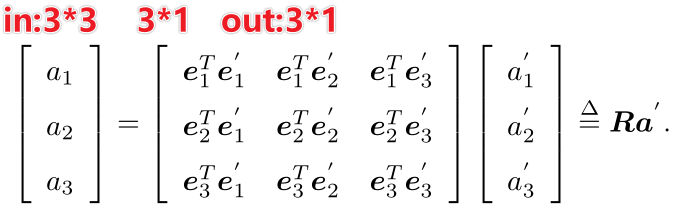

      旋转矩阵的性质：行列式为1的正交矩阵。

      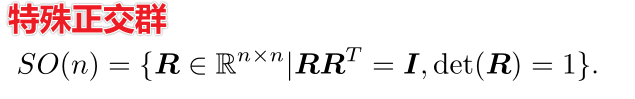

      

      旋转+平移

      

   3. 变换矩阵与齐次坐标

      

      三维向量的齐次坐标变为四维。

      

3. useEigen项目介绍

   

   矩阵相关知识

   

   重要的矩阵计算

   

   矩阵解方程

   

4. 旋转向量和欧拉角

   为什么有了旋转矩阵和变换矩阵，还要继续研究旋转向量？

   

   原理

   

   欧拉角

   

5. 四元数

   为什么需要四元数？

   

   四元数的表示

   

   四元数的运算

   

   

   四元数与三维空间的旋转

   

   单位旋转向量与单位四元数

   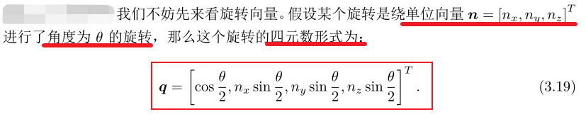

   

   **用四元数表示旋转**

   

   

   常见的变换

   

6. useGeometry

   ```c++
   // Eigen/Geometry 模块提供了各种旋转和平移的表示
     // 3D 旋转矩阵直接使用 Matrix3d 或 Matrix3f
     Matrix3d rotation_matrix = Matrix3d::Identity();
     // 旋转向量使用 AngleAxis, 它底层不直接是Matrix，但运算可以当作矩阵（因为重载了运算符）
     AngleAxisd rotation_vector(M_PI / 4, Vector3d(0, 0, 1));     //沿 Z 轴旋转 45 度
     cout.precision(3);
     cout << "rotation matrix =\n" << rotation_vector.matrix() << endl;   //用matrix()转换成矩阵
     // 也可以直接赋值
     rotation_matrix = rotation_vector.toRotationMatrix();
     // 用 AngleAxis 可以进行坐标变换
     Vector3d v(1, 0, 0);
     Vector3d v_rotated = rotation_vector * v;
     cout << "(1,0,0) after rotation (by angle axis) = " << v_rotated.transpose() << endl;
     // 或者用旋转矩阵
     v_rotated = rotation_matrix * v;
     cout << "(1,0,0) after rotation (by matrix) = " << v_rotated.transpose() << endl;
   
     // 欧拉角: 可以将旋转矩阵直接转换成欧拉角
     Vector3d euler_angles = rotation_matrix.eulerAngles(2, 1, 0); // ZYX顺序，即yaw-pitch-roll顺序
     cout << "yaw pitch roll = " << euler_angles.transpose() << endl;
   
     // 欧氏变换矩阵使用 Eigen::Isometry
     Isometry3d T = Isometry3d::Identity();                // 虽然称为3d，实质上是4＊4的矩阵
     T.rotate(rotation_vector);                                     // 按照rotation_vector进行旋转
     T.pretranslate(Vector3d(1, 3, 4));                     // 把平移向量设成(1,3,4)
     cout << "Transform matrix = \n" << T.matrix() << endl;
   
     // 用变换矩阵进行坐标变换
     Vector3d v_transformed = T * v;                              // 相当于R*v+t
     cout << "v tranformed = " << v_transformed.transpose() << endl;
   
     // 对于仿射和射影变换，使用 Eigen::Affine3d 和 Eigen::Projective3d 即可，略
   
     // 四元数
     // 可以直接把AngleAxis赋值给四元数，反之亦然
     Quaterniond q = Quaterniond(rotation_vector);
     cout << "quaternion from rotation vector = " << q.coeffs().transpose()
          << endl;   // 请注意coeffs的顺序是(x,y,z,w),w为实部，前三者为虚部
     // 也可以把旋转矩阵赋给它
     q = Quaterniond(rotation_matrix);
     cout << "quaternion from rotation matrix = " << q.coeffs().transpose() << endl;
     // 使用四元数旋转一个向量，使用重载的乘法即可
     v_rotated = q * v; // 注意数学上是qvq^{-1}
     cout << "(1,0,0) after rotation = " << v_rotated.transpose() << endl;
     // 用常规向量乘法表示，则应该如下计算
     cout << "should be equal to " << (q * Quaterniond(0, 1, 0, 0) * q.inverse()).coeffs().transpose() << endl;
   
   ```

   旋转相关的数据结构

   

7. visualizeGeometry

   工程配置

   

   可视化效果

   

8. 整个项目的cmake配置

   
##### ch4
1. 李群李代数

   为什么需要李群、李代数？

   

   群

   

   李群

   

   李代数的引入（反对称矩阵）

   

   

   

  2. 李代数与李群之间的映射

​		   

   	李群乘法与李代数加法的关系

​		   

3. 李代数求导、扰动模型（左乘）

   为什么需要研究李代数上的求导？

   

   

   思路一：李代数求导：比较复杂，不实用（旋转矩阵）

   

   思路二：扰动模型（旋转矩阵）

   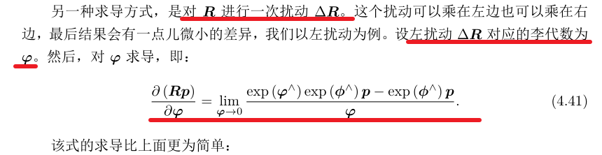

   

   思路二：扰动模型（变换矩阵）

   

4. useSophus
   
   - 第三方库Sophus
   
     这是李群的 C++ 实现，通常用于 2d 和 3d 几何问题（即用于计算机视觉或机器人应用程序）。 其中，这个包包括特殊正交群 SO(2) 和 SO(3) 来表示 2d 和 3d 中的旋转，以及特殊的欧几里得群 SE(2) 和 SE(3) 来表示刚体变换（即旋转 和翻译）在 2d 和 3d 中。
   
     ```shell
     # 使用非模板的 Sophus 库(第一版)
     git clone https://github.com/strasdat/Sophus.git
     cd Sophus
     git checkout a621ff
     # 使用带模版的库（第二版）。需要安装
     cmake ..
     make
     sudo make install
     sudo ldconfig
     ```
   
   - Sophus需要依赖eigen3.3以上版本
   
     ```shell
     # 查看已安装的eigen版本
     cat /usr/include/eigen3/Eigen/src/Core/util/Macros.h
     # 或者
     cat /usr/local/include/eigen3/Eigen/src/Core/util/Macros.h
     ```
   
     
   
   - Sophus依赖fmt（版本需要匹配fmt：7）
   
     ```shell
     # 下载并安装fmt
     git clone https://github.com/fmtlib/fmt.git
     cmake ..
     make
     sudo make install
     sudo ldconfig
     ```
   
   - 卸载Sophus库
   
     ```shell
     # 1.删除头文件
     sudo rm -r /usr/local/include/sophus
     # 2.删除库文件
     sudo rm -r /usr/local/lib/libsophus*
     # 3.删除库的可执行文件
     sudo rm -r /usr/local/bin/sophus*
     ```
   
     
   
   - 安装Sophus库
   
     ```shell
     # 使用带模版的库（第二版）。需要安装
     cmake ..
     make
     sudo make install
     sudo ldconfig
     ```
   
     
   
   cmake配置
   
   
   
   
   
   编译
   
   ```shell
   # 编译example项目
   cmake -D USE_UBUNTU_20=ON ..
   make
   ```

##### ch5

1. 针孔相机模型

   

   内参矩阵

   

   

   外参矩阵、归一化平面

   

2. 畸变

   

   畸变模型

   

3. 双目相机模型

   背景（单目无法确定深度信息）

   

   视差计算原理

   

   

4. RGB-D相机

   

5. 图像的表示

   

6. 项目编译

   

   问题：无法打开 libc-start.c、raise.c。解决：将opencv4版本删除干净，使用opencv3.4.16版本

   

   ```shell
   # 1.安装glibc
   sudo apt install glibc-source
   cd /usr/src/glibc/
   sudo tar -xvf glibc-[VERSION].tar.xz
   # 2.在 VSCode 文件夹下的.vscode/launch.json中添加以下内容：（修改 S&xCS9 为报错提示中出现的glibc文件名）
   "sourceFileMap": {
         "/build/glibc-S7xCS9": "/usr/src/glibc"
   }
   ```

   cv::waitKey()函数详解

   

##### ch6

1. 状态估计问题

   

   最小二乘问题的迭代求解

   

   一阶和二阶梯度法（最速下降法、牛顿法）

   

   

   更好的两种方法:Gauss-Newton

   

   

   

   更好的两种方法:Levenberg-Marquadt

   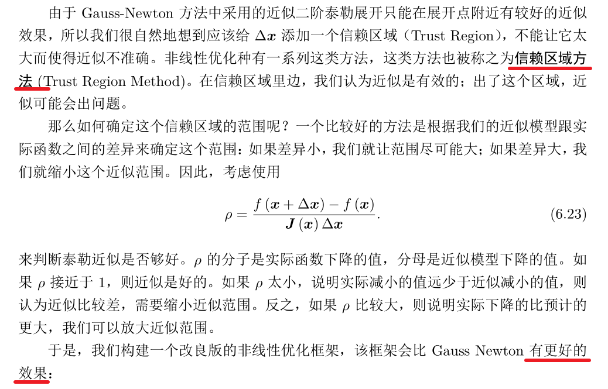

   

2. 第三方库

   - Ceres

     Ceres Solver 是一个开源 C++ 库，用于建模和解决大型、复杂的优化问题。 它是一个功能丰富、成熟且高性能的库，自 2010 年以来一直在 Google 生产中使用。Ceres Solver 可以解决两种问题：

     ​	1）具有边界约束的非线性最小二乘问题。
     ​	2）一般无约束优化问题。

     ```shell
     # 下载
     git clone https://github.com/ceres-solver/ceres-solver.git
     
     # 先安装依赖库
     # CMake
     sudo apt-get install cmake
     # google-glog + gflags
     sudo apt-get install libgoogle-glog-dev libgflags-dev
     # Use ATLAS for BLAS & LAPACK
     sudo apt-get install libatlas-base-dev
     # Eigen3
     sudo apt-get install libeigen3-dev
     # SuiteSparse and CXSparse (optional)
     sudo apt-get install libsuitesparse-dev
     # 14讲增加内容
     sudo apt-get install liblapack-dev libcxsparse3 libgtest-dev
     
     tar zxf ceres-solver-2.1.0.tar.gz
     mkdir ceres-bin
     cd ceres-bin
     cmake ../ceres-solver-2.1.0
     make -j3
     make test
     # Optionally install Ceres, it can also be exported using CMake which
     # allows Ceres to be used without requiring installation, see the documentation
     # for the EXPORT_BUILD_DIR option for more information.
     make install
     ```

     

   - g2o - General Graph Optimization

     g2o是一个开源 C++ 框架，用于优化基于图的非线性误差函数。 g2o被设计成可以轻松扩展到广泛的问题，并且通常可以在几行代码中指定一个新问题。 当前的实现为 SLAM 和 BA 的几种变体提供了解决方案。

     ```shell
     # 安装依赖库
     sudo apt-get install qt5-qmake qt5-default libqglviewer-dev-qt5 libsuitesparse-dev libcxsparse3 libcholmod3
     # 编译安装g2o
     ```

   

3. 编译

   

   ceres求解

   区分：目标函数、核函数、代价函数（代价函数+核函数=>目标函数）；明确参数块（待优化变量）

   

   

   g2o图优化问题

   

   

   

##### ch7

1. 视觉里程计1（VO前端）：基于特征点

2. 特征点法

   

   SIFT(Scale-Invariant Feature Transform)：尺度不变特征变换，考虑了图像变换过程中的光照，尺度，旋转等变化。精度高，速度慢。

   ORB（Oriented FAST and Rotated BRIEF）是目前看来非常具有代表性的实时图像特征。它改进了 FAST 检测子 不具有方向性的问题，并采用速度极快的二进制描述子BRIEF，使整个图像特征提取的环节大大加速。

3. 代码编译

   

4. 估计相机运动的方法

   

   - 2D-2D：对极几何（p1、p2是像素坐标；x1、x2是两个像素点的归一化平面的坐标）

   - 本质矩阵和单应矩阵都需要经过分解后，才能得到相机的外参信息

     

     

     

     本质矩阵

     

     

     

     单应矩阵

     

     

     单应矩阵的应用场景

     

   - 三角测量

   - 3D-2D：PnP

     

     

   - BA优化

     

   - 3D-3D：ICP（SVD方法；BA优化方法）

##### ch12

1. 单目稠密重建实验

   实验数据下载：http://rpg.ifi.uzh.ch/datasets/remode_test_data.zip

2. 编译设置修改

   dense_mono

   

   dense_RGBD

   

   

2. 

#### 深度学习入门

##### Python入门

1. Python库

   - NumPy

     NumPy 是 Python 中科学计算的基础包。 它是一个 Python 库，提供多维数组对象、各种派生对象（例如掩码数组和矩阵）以及用于对数组进行快速操作的各种例程，包括数学、逻辑、形状操作、排序、选择、I/O 、离散傅里叶变换、基本线性代数、基本统计运算、随机模拟等等。

   - Matplotlib

     Matplotlib 是一个综合库，用于在 Python 中创建静态、动画和交互式可视化。 Matplotlib 让简单的事情变得简单，让困难的事情成为可能。

     ​	创建出版质量图。
     ​	制作可以缩放、平移、更新的交互式图形。
     ​	自定义视觉样式和布局。
     ​	导出为多种文件格式。
     ​	嵌入 JupyterLab 和图形用户界面。
     ​	使用基于 Matplotlib 构建的丰富的第三方包。

2. numpy深度学习常用函数及参数理解

   - axis

     
     

  
     
- keepdims
  
  
  
- shape,dtype,ndim(A)
  
  
  
  ndim(A,B)：获取两矩阵乘积
  
- argmax(A,axis=x)
  
  
  
- reshape
  
  
  
  
  
- log()
  
  
  
  
  
- sum()
  
  
  
  
  
- arange
  
  
  
  
  
- rand()和randn()
  
  
  
  
  
- zeros(),zeros_like()
  
  
  
  
  
- choice()
  
  
  
  
  
- concatenate()
  
  矩阵拼接
  
  
  
  
  
- shuffle
  
  
  
  
  
- mean
  
  
  
  
  
- std
  
  
  
  
  
- expand_dims
  
  
  
- 

##### 感知机

##### ch4神经网络


#### Python学习

##### 环境配置

1. 基础介绍

   - 说明：目前python有两个版本，2.x版和3.x版，这两个版本不兼容。python3.x版越来越流行。

   - 官网下载python：http://www.python.org/download/

   - 安装完成后，需要添加两个路径到环境变量

     

2. python第三方库安装方法

   1. 直接使用pip install安装

      前提：将"python/Scripts/"添加到系统环境变量中。

      注意：先输入pip list检查是否需要更新pip。

      更新pip命令：python -m pip install --upgrade pip

      pip install 库名

   2. 下载whl文件再安装

      注意下载对应版本。第三方库文件下载地址：

      https://www.lfd.uci.edu/~gohlke/pythonlibs/#genshi

      https://pypi.org

      下载完成后，将.whl文件放到python安装目录下的 *\Lib\site-packages* 路径下。

      然后打开cmd，输入`pip install`以后，把.whl **拖 进 来**，回车即可安装。

      

   3. 在pycharm中安装

      

   4. 通过国内源进行安装（推荐使用，下载速度会比较快）

      ```shell
      清华：https://pypi.tuna.tsinghua.edu.cn/simple
      阿里：https://mirrors.aliyun.com/pypi/simple/
      中科大：https://pypi.mirrors.ustc.edu.cn/simple/
      ```

      使用方法很简单 只需要到cmd当中输入指令：

      pip install -i https源地址 库名  即可

      例如安装requests：

      pip install -i [https://pypi.tuna.tsinghua.edu.cn/simple](https://link.zhihu.com/?target=https%3A//pypi.tuna.tsinghua.edu.cn/simple) requests

   5. 使用conda安装

   6. 安装问题1：python安装路径下的Script->sitepackages中没有pip包。

      原因：之前安装过conda，重新安装python解释器时自动将Script->sitepackages安装到另外的目录下。

      解决方法：

3. 

##### 爬虫模块

###### urllib

1. 基础网络知识

   

2. 反爬机制

   1. 伪装UA

      

      方法：请求对象的定制

      

   2. 

3. 编码集

   

   统一编码：unicode

4. 

###### 解析模块-xpath-jsonpath-bs4

1. 说明：xpath比bs4好，bs4用户接口体验好。jsonpath用于解析json格式。

   xpath支持解析本地文件、网页文件；

   jsonpath只支持解析本地文件；

   bs4支持解析本地文件、网页文件。
   
2. xpath（还需要安装第三方库：lxml）

   注意：解析“本地文件”和“服务器响应文件”的格式不同。

   

3. 基本使用

   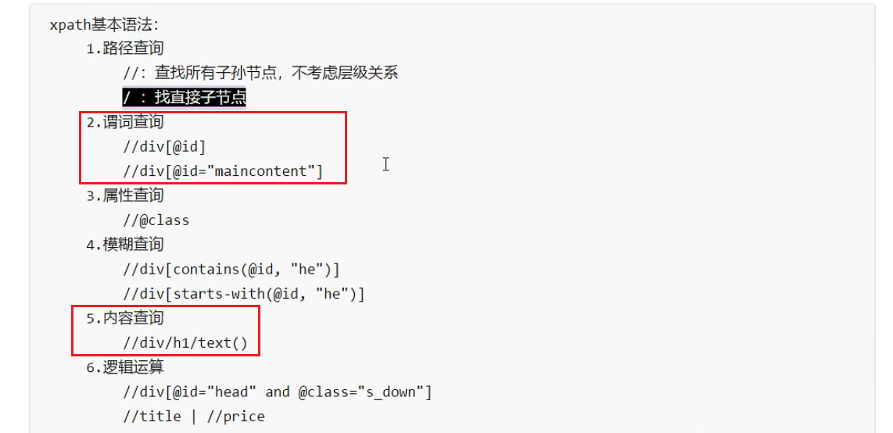

   示例：

   

   

###### 浏览器模拟模块-selenium

1. 简介：驱动浏览器

   

2. 环境配置
   
   - ChromeDriver下载说明
   
   ​	下载链接：http://chromedriver.storage.googleapis.com/index.html
   
   ​	查看本机chrome版本
   
   ​	
   
   ​	下载高于本机版本的驱动文件
   
   ​	
   
   ​	对应操作系统
   
   
   
   - 安装第三方库selenium
   
     pip install selenium
   
   
   
2. 加速插件：selenium_handless（无界面驱动浏览器，性能更好）

   

###### requests

1. 官方文档：https://requests.readthedocs.io/en/latest/   

   库文件：https://pypi.org/project/requests/

2. 简介

   
   
3. 用法

   ```python
   
   ```

   

###### scrapy-爬虫框架

1. 简介

2. 安装

   

   

3. 工作原理

   

4. 解决多条文件写入文件时，对文件的频繁操作（使用scrapy的管道）

   

5. scrapyshell（调试工具）

6. crawlspider

7. scrapy的post请求

   

#### 剑指Offer

##### STL

unordered_map插入元素的区别：


unordered_map取出value：

```
unordered_map<char,int>::itrator it = mmap.find(c);
int val = it->second;
```

#### 数据结构与算法

##### 二叉搜索树BST

1. BST的性质

   

   满足中序遍历的有序性。

2. 函数接口

   

   - Find

     算法描述

     

     实现：查找效率取决于树的高度

     ```c
     //二叉树的定义
     typedef struct TreeNode *BinTree;  //BinTree<=>strcut TreeNode *
     typedef BinTree Position;
     struct TreeNode{
         ElementType Data;
         BinTree Left;
         BinTree Right;
     }
     //方法一：查找接口("尾递归实现，效率不高")
     Position Find(ElementType X,BinTree BST)
     {
         if(!BST) return NULL; //查找失败
         if(X > BST->Data)
             return Find(X,BST->Right);
         else if(X < BST->Data)
             return Find(X,BST->Left);
         else
             return BST;
     }
     //方法二：查找接口("循环实现，将“尾递归"改为迭代函数)
     Position IterFind(ElementType X,BinTree BST)
     {
         while(BST)
         {
             if(X > BST->Data)
                 BST=BST->Right;
             else if(X < BST->Data)
                 BST=BST->Left;
             else
                 return BST;
         }
         return NULL;
     }
     ```

     typedef的用法

     

   - 

3. 

##### 平衡二叉树BBST

1. 为什么需要平衡二叉树？

   

   为了提升查找的性能，解决最坏的查找情况（退化成链表），提出平衡二叉树。

2. 理想平衡和适度平衡

   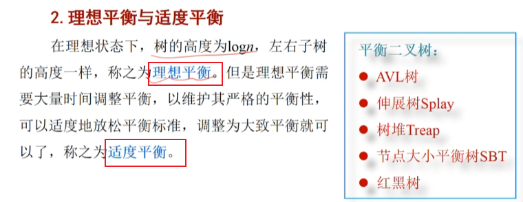

   AVL树：左右子树高差小于2。

   set/map内部实现：红黑树（左右子树高差不超过2倍）。=>平衡标准更放松！参考书籍“**趣学数据结构**”。

3. 平衡二叉树性质

   

4. 插入新的节点，依据平衡因子进行调平

   

   四种调平衡的方法：LL旋转

   

   RR旋转

   

   LR旋转

   

   RL旋转

   

5. 


##### 优先队列（最大/最小堆）

完全二叉树

有序性

